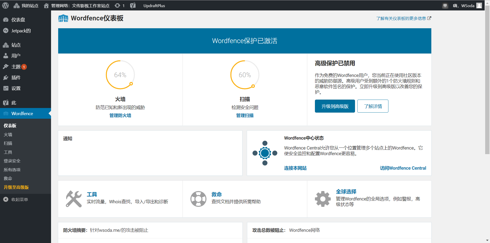

# 网站运营报告

- 网站：文传影视工作室-记录最美时光
- 地址：https://wsoda.me/
- 站长：叶琛
- 网站内容来源：[文传影视工作室微信公众号](http://mp.weixin.qq.com/mp/homepage?__biz=MzI5ODY0NzgwMA==&hid=1&sn=6addcbb26d5250ce2fd2705c94a84926&scene=18#wechat_redirect)
- 指导老师：[吴雪](http://wcy.nfu.edu.cn/a/xinmeitiyanjiuzhongxin/20180530/714.html)

## 目录
- [策划文档与网站地图](#策划文档与网站地图)
- [图库版权](#图库版权)
- [图库风格及配色](#图库风格及配色)
- [云端架站踩坑图文文章](#云端架站踩坑图文文章)
- [平面设计](#平面设计)
- [云端架站](#云端架站)
- [站长工具](#站长工具)
- [SEO优化](#SEO优化)
- [用户研究成果及设计改进](#用户研究成果及设计改进)
- [定制化](#定制化)
- [加分项](#加分项)

## 策划文档与网站地图

1. 建设目标

- 宣传文传影视工作室，为学生及摄影爱好者了解文传影视工作室的提供网页端渠道，展示工作室影视作品。
- 向文传影视工作室微信公众号引流。

2. 目标用户画像

- **学生：**
  - 场景：通过网页快速浏览文传影视工作室的作品文章，以及预约摄影服务。
  - 痛点：能快速浏览往期作品文章，而不受微信繁复搜索查找操作限制。
- **摄影爱好者：**
  - 场景：通过搜索引擎搜索优秀的摄影作品，了解高校工作室的影视作品。
  - 痛点：需要清晰的摄影作品分类，方便高效浏览摄影作品。

3. 网站规划

一阶段：构建网站页面架构，设计网页配色，页面效果。

二阶段：搬运往期作品、文章内容与添加摄影服务，完善版权说明。

三阶段：动态更新作品与文章，或增加文创商品商城，不断完善网站。

- DVF模型

- 网站地图

## 图库版权

网站摄影图片来源：[文传影视工作室微信公众号](http://mp.weixin.qq.com/mp/homepage?__biz=MzI5ODY0NzgwMA==&hid=1&sn=6addcbb26d5250ce2fd2705c94a84926&scene=18#wechat_redirect)
运营报告部分图片来源：自制截图

## 图库风格及配色

## 云端架站踩坑图文文章
- [x] 3篇详细步骤的云端架站踩坑图文文章
- [申请Github学生开发包-WordPress云端架站（一）](https://wsoda.me/blog/2019/05/21/wp-website1/)
- [Digital Ocean架站-WordPress云端架站（二）](https://wsoda.me/blog/2019/05/24/wp-website2/)
- [网站域名配置-WordPress云端架站（三）](https://wsoda.me/blog/2019/05/24/wp-website3/)

## 平面设计

1. 网站配色，背景及字体的对比度 及可读性

2. Animate it! 及Siteorigin

## 云端架站

- [x] **域名：https://wsoda.me/**

- [x] **wordfence** 已安装wordfence并按照指引安装其防火墙扩展保护模块，达到防火墙状态免费版用户可达到的最大值64%。

- [x] **site24x7**
通过site24x7部署监视器 “wsoda世界” 选取8个监控地点为香港、伦敦、巴黎、圣保罗、纽约、莫斯科、东京、旧金山，平均响应时间2s比较优良。

但是，其中莫斯科因法务原因不可用（451），网站因法律规定被封锁，无法访问且无法解决问题。

另外我还部署了监视器 “wsoda亚太” 选取8个监控地点为上海、香港、北京、东京、旧金山、深圳、广州、成都,平均响应时间4s且，其中上海、北京、深圳、广州、成都连接状态并不稳定且响应时间长，推测原因为dns服务器处于海外，中国大陆访问速度慢。

- [x] **网站备份**
- FTP传输工具截图

- wp-config.php文件备份

- 数据库文件备份

- wordpress后台导出工具导到本地的文件

## 站长工具

- Bing

- 百度

## SEO优化

## 用户研究成果及设计改进
1.用户访谈

2.AB测试

## 定制化
- 版权保护插件：[WP-Copyright-Protection](https://wordpress.org/plugins/wp-copyright-protection/)
  
  - 禁用右键单击
  - 禁用文本选择
  - 禁用文本，图像拖放
  - 禁用内容选择
  - 禁用复制快捷键
  - iframe保护可让您的网站脱离iframe
  - **保护文传影视工作室的原创摄影作品，使其无法被复制保存，保护版权。**

- 将jpeg/png等图片转换为WebP的插件：[WebP Express](https://wordpress.org/plugins/webp-express/)
  
  - WebP 图片加载速度快，大小通常为jpeg的一半。
  - **网站图片内容较多，将jpeg/png等格式的图片转换为WebP格式，提高网站加载速度，优化用户体验。**

  同时修改了functions.php，解决了webp图片无法上传和无法在媒体库预览的问题。
  

## 加分项

- [x] **使用https，且开启多站点**
- SSL证书：https://wsoda.me/ （注意：安装ssl证书后，关闭了80端口即http的访问仅通过443端口访问）

- 多站点：

